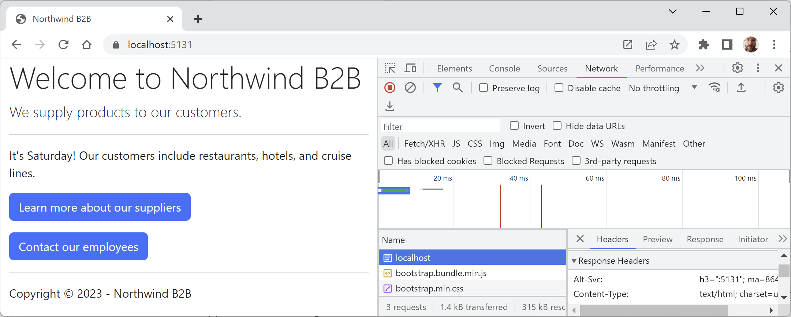

**Enabling HTTP/3 and request decompression support**

- [Introducing HTTP/3](#introducing-http3)
- [Enabling HTTP/3 support](#enabling-http3-support)
- [Testing if HTTP/3 is enabled](#testing-if-http3-is-enabled)
- [Introducing request decompression](#introducing-request-decompression)
- [Enabling request decompression support](#enabling-request-decompression-support)

# Introducing HTTP/3

**HTTP/3** uses the same request methods, like `GET` and `POST`, the same status codes, like `200` and `404`, and the same headers, but encodes them and maintains session state differently because it runs over QUIC rather than the older and less efficient Transmission Control Protocol (TCP).

At the time of writing in July 2023, HTTP/3 is supported by about 95% of tracked browsers and 26% of the top 10 million websites. Chromium-based browsers like Chrome, Edge, and Opera since 2020. It is more recently supported by Firefox and Safari on macOS and iOS (although it is disabled by default).

> **More Information**: Usage statistics of HTTP/3 for websites: https://w3techs.com/technologies/details/ce-http3 and Can I use HTTP/3? https://caniuse.com/?search=HTTP%2F3.

HTTP/3 brings benefits to all internet-connected apps, but especially mobile, because it supports connection migration using UDP with TLS built in, so the device does not need to reconnect when moving between WiFi and cellular networks. Each frame of data is encrypted separately so it no longer has the head-of-line blocking problem in HTTP/2 that happens if a TCP packet is lost and therefore all the streams are blocked until the data can be recovered.

# Enabling HTTP/3 support

.NET 8 previews enabled HTTP/3 by default so you did not need to enable it yourself. But in the release candidate, the team decided to disable it again. They did this due to a bad experience caused by some anti-virus software. Hopefully in ASP.NET Core 9 they will solve this issue and re-enable HTTP/3 by default. You can read more about this issue at the following link:
https://devblogs.microsoft.com/dotnet/asp-net-core-updates-in-dotnet-8-rc-1/#http-3-disabled-by-default

.NET 6 supported HTTP/3 as a preview feature for both clients and servers. .NET 7 delivered final full support for the following operating systems:
- Windows 11 and Windows Server 2022.
- Linux; you can install QUIC support using sudo apt install libmsquic.

If you have one of the supported operating systems listed above, let's enable HTTP/3 support in the `Northwind.Web` project:

1.	In `Program.cs`, import the namespace for working with HTTP protocols, as shown in the following code:
```cs
using Microsoft.AspNetCore.Server.Kestrel.Core; // To use HttpProtocols.
```
2.	In `Program.cs`, add statements before the call to `Build` to enable all three versions of HTTP, as shown in the following code:
```cs
builder.WebHost.ConfigureKestrel((context, options) =>
{
  options.ConfigureEndpointDefaults(listenOptions =>
  {
    listenOptions.Protocols = HttpProtocols.Http1AndHttp2AndHttp3;
    listenOptions.UseHttps(); // HTTP/3 requires secure connections.
  });
});
```

> **Good Practice**: You should enable more than just HTTP/3 since some browsers still do not support it or even HTTP/2.

# Testing if HTTP/3 is enabled

To determine if HTTP/3 is enabled for a website project, we must set an increased level of logging:

1.	In `appSettings.json`, add an entry to show hosting diagnostics, as shown in the following configuration:
```json
{
  "Logging": {
    "LogLevel": {
      "Default": "Information",
      "Microsoft.AspNetCore": "Warning",
      // Enable logging of HTTP version.
      "Microsoft.AspNetCore.Hosting.Diagnostics": "Information"
    }
```
2.	Start the website project using the `https` launch profile.
3.	In Chrome, view Developer tools and select the **Network** tab.
4.	Navigate to https://localhost:5131/, and note the **Response Headers** include an entry for `alt-svc` with a value of `h3` indicating Kestrel has enabled HTTP/3 support, as shown in *Figure 13B.1*:

 
*Figure 13B.1: Chrome showing support for HTTP/3*

5. Unfortunately, if you review the output at the command prompt or terminal, or review Chrome diagnostic tools, you will find that the connection uses HTTP/2. This is because, "Browsers don't allow self-signed certificates on HTTP/3, such as the Kestrel development certificate", as described here: https://learn.microsoft.com/en-us/aspnet/core/fundamentals/servers/kestrel/http3#localhost-testing. The official documentation does not show a work around because Microsoft decided the steps are too difficult. You can read about the issue here if you want to try the complex workaround: https://github.com/dotnet/AspNetCore.Docs/issues/23700.

6.	Close Chrome and shut down the web server.

You can learn more about .NET support for HTTP/3 at the following links:
- HTTP/3 support in .NET: https://devblogs.microsoft.com/dotnet/http-3-support-in-dotnet-6/.
- .NET Networking Improvements – HTTP/3 and QUIC: https://devblogs.microsoft.com/dotnet/dotnet-6-networking-improvements/#http-3-and-quic.
- Use HTTP/3 with the ASP.NET Core Kestrel web server: https://learn.microsoft.com/en-us/aspnet/core/fundamentals/servers/kestrel/http3.

# Introducing request decompression

To make HTTP requests and responses more efficient, the HTTP body content can be compressed using standard algorithms like gzip, Brotli, and Deflate, and an HTTP header is added to indicate which was used.
In the past, the developer had to implement decompression before processing the body if a browser sent a compressed request. With ASP.NET Core 7 or later, middleware to do this for you is built in and just needs to be added to the pipeline.

Unfortunately, this is tricky to try out because browsers cannot initiate a compressed request. This is because the browser cannot know if the server can handle it. Compression is normally enabled by the browser sending an uncompressed request with a header informing the server what algorithms the browser understands, as shown in the following request:
```
Accept-Encoding: gzip, deflate, br, compress
```
The server can then decide to compress its response and it sets a similar header in its response if it does, as shown in the following response:
```
Content-Encoding: gzip
```

# Enabling request decompression support

We will just see how to enable the server side to receive HTTP requests with compressed body content in those rare scenarios where the browser or another client makes one:

1.	In the `Northwind.Web` project, in `Program.cs`, add statements after the call to `AddNorthwindContext` to add the request compression middleware, as shown in the following code:
```cs
builder.Services.AddRequestDecompression();
```
2.	In `Program.cs`, add statements after the call to use HTTPS redirection to use request decompression, as shown in the following code:
```cs
app.UseRequestDecompression();
```
