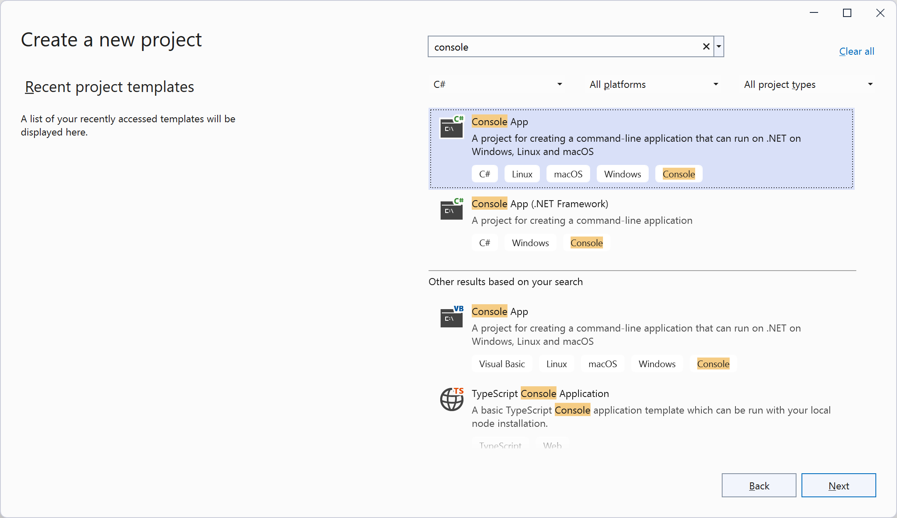
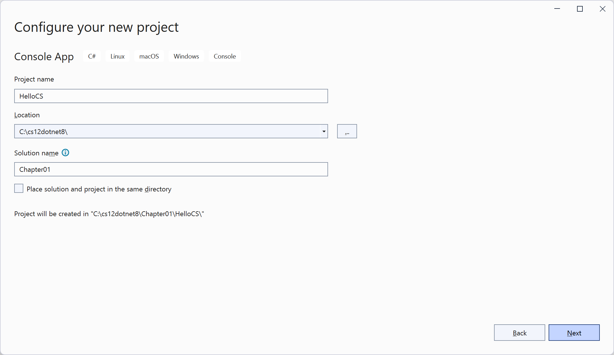
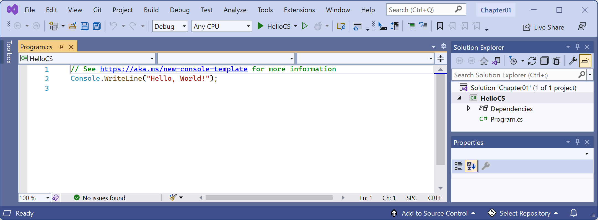
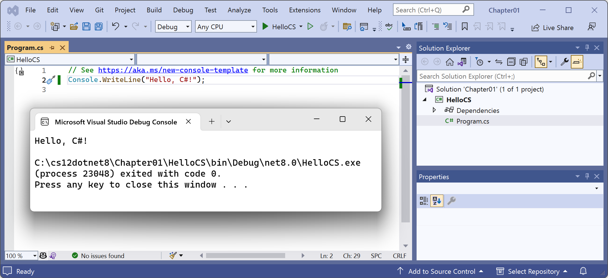
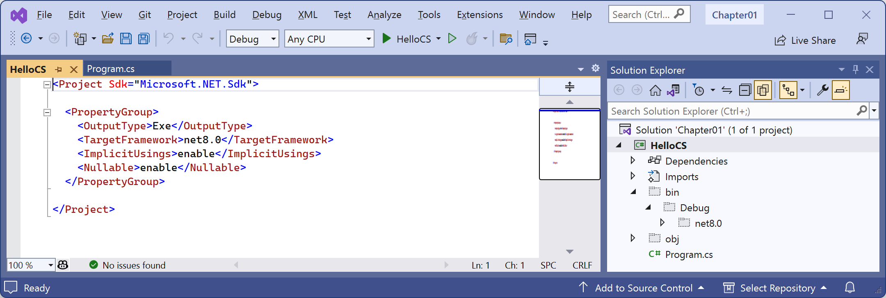
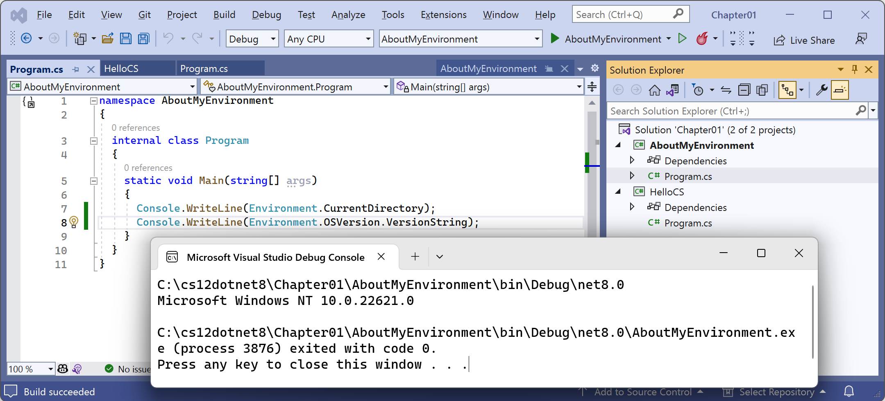

**Using Visual Studio 2022 for Windows**

In this article, I provide detailed step-by-step instuctions for using Visual Studio 2022 for Windows for topics like creating a solution with multiple projects and using debugging tools.

- [Chapter 1 - Hello, C#! Welcome, .NET!](#chapter-1---hello-c-welcome-net)
  - [Downloading and installing Visual Studio 2022](#downloading-and-installing-visual-studio-2022)
  - [Building console apps using Visual Studio 2022](#building-console-apps-using-visual-studio-2022)
    - [Managing multiple projects using Visual Studio 2022](#managing-multiple-projects-using-visual-studio-2022)
    - [Writing code using Visual Studio 2022](#writing-code-using-visual-studio-2022)
  - [Compiling and running code using Visual Studio](#compiling-and-running-code-using-visual-studio)
  - [Understanding the compiler-generated folders and files](#understanding-the-compiler-generated-folders-and-files)
  - [Understanding top-level programs](#understanding-top-level-programs)
    - [Requirements for top-level programs](#requirements-for-top-level-programs)
    - [Implicitly imported namespaces](#implicitly-imported-namespaces)
    - [Revealing the hidden code by throwing an exception](#revealing-the-hidden-code-by-throwing-an-exception)
  - [Adding a second project using Visual Studio 2022](#adding-a-second-project-using-visual-studio-2022)
- [Chapter 4 (coming soon)](#chapter-4-coming-soon)

# Chapter 1 - Hello, C#! Welcome, .NET!

## Downloading and installing Visual Studio 2022

If you have not already installed Visual Studio 2022 for Windows, let's do so now:

1.	Download Microsoft Visual Studio 2022 version 17.8 or later for Windows from the following link: https://visualstudio.microsoft.com/downloads/.
2.	Start the installer.
3.	On the **Workloads** tab, select the following:
    -	ASP.NET and web development
    -	.NET desktop development
4. On the **Individual components** tab, in the **Code tools** section, select the following:
    - Git for Windows
5.	Click **Install** and wait for the installer to acquire the selected software and install it.
6.	When the installation is complete, click **Launch**.
7.	The first time that you run Visual Studio 2022, you will be prompted to sign in. If you have a Microsoft account, you can use that account. If you don't, then register for a new one at the following link: https://signup.live.com/
8.	The first time that you run Visual Studio 2022, you will be prompted to configure your environment. For **Development Settings**, choose **Visual C#**. For the color theme, I chose **Blue**, but you can choose whatever tickles your fancy.
9.	If you want to customize your keyboard shortcuts, navigate to **Tools** | **Options...**, and then select the **Keyboard** section.

## Building console apps using Visual Studio 2022

The goal of this section is to showcase how to build a console app using Visual Studio 2022 for Windows. 

### Managing multiple projects using Visual Studio 2022

Visual Studio 2022 has a concept named a solution that allows you to open and manage multiple projects simultaneously. We will use a solution to manage the two projects that you will create in this chapter.

### Writing code using Visual Studio 2022

Let's get started writing code!

1.	Start **Visual Studio 2022**.
2.	In the **Welcome** tab, click **New Project**, as shown in *Figure 1.3*:


*Figure 1.3: Creating a new project in Visual Studio 2022*

3.	In the **Create a new project** dialog,  select the C# language to filter the project templates, and then enter `console` in the **Search for templates** box, and select **Console App**, making sure that you have chosen the cross-platform project template, not the one for .NET Framework, which is Windows-only, and the C# project template rather than another language, such as Visual Basic or TypeScript, so that it is selected as shown in *Figure 1.4*:

 
*Figure 1.4: Selecting the Console App project template*

4.	Click **Next**.
5.	In the **Configure your new project** dialog, enter `HelloCS` for the project name, enter `C:\cs12dotnet8` for the location, and enter `Chapter01` for the solution name, as shown in *Figure 1.5*:

 
*Figure 1.5: Configuring names and locations for your new project*

6.	Click **Next**.
7.	In the **Additional information** dialog, in the **Framework** drop-down list, note that your .NET SDK choices indicate if that version is **Standard Term Support**, **Long Term Support**, **Preview**, or **Out of support**, and then select **.NET 8.0 (Long Term Support)**.

> If you are missing a .NET SDK version, then you can install it from the following link: https://dotnet.microsoft.com/en-us/download/dotnet. 

8. Leave the check box labelled **Do not use top-level statements** cleared, and then click **Create**. (Later in this chapter you will create a console app that selects this option so you can see the difference.)
9. If you cannot see the **Solution Explorer**, then navigate to **View** | **Solution Explorer**.
10.	If code is not shown, then in  **Solution Explorer**, double-click the file named `Program.cs` to open it, and note that **Solution Explorer** shows the `HelloCS` project, as shown in *Figure 1.6*:
 

*Figure 1.6: Editing Program.cs in Visual Studio 2022*

11.	In `Program.cs`, note the code consists of only a comment and a single statement. This is because it uses the top-level program feature introduced in C# 9, as shown in the following code:
```cs
// See https://aka.ms/new-console-template for more information
Console.WriteLine("Hello, World!");
```
> As the comment in the code says, you can read more about this template at the following link: https://aka.ms/new-console-template.

12. In `Program.cs`, modify line 2 so that the text that is being written to the console says `Hello, C#!`.

> All code examples and commands that the reader must review or type are shown in plain text so you will never have to read code or commands from a screenshot like in *Figure 1.6* that might be too small or too faint in print.

## Compiling and running code using Visual Studio

The next task is to compile and run the code.

1.	In Visual Studio, navigate to **Debug** | **Start Without Debugging**. 

> **Good Practice**: When you start a project in Visual Studio 2022, you can choose to attach a debugger or not. If you do not need to debug, then it is better not to attach one because attaching a debugger requires more resources and slows everything down. Attaching a debugger also limits you to only starting one project. If you want to run more than one project, each with a debugger attached, then you must start multiple instances of Visual Studio. In the toolbar, click the green outline triangle button to start without debugging instead of the green solid triangle button unless you need to debug.

2.	The output in the console window will show the result of running your application, as shown in *Figure 1.7*: 
 

*Figure 1.7: Running the console app on Windows*

3.	Press any key to close the console window and return to Visual Studio 2022.
4. Optionally, close the **Properties** pane to make more vertical space for **Solution Explorer**.
5. Double-click the `HelloCS` project and note the `HelloCS.csproj` project file shows that this console app targets `net8.0`, as shown in *Figure 1.8*.
6.	In the **Solution Explorer** toolbar, toggle on the **Show All Files** button, and note the compiler-generated `bin` and `obj` folders are visible, as shown in *Figure 1.8*: 


*Figure 1.8: Showing the compiler-generated folders and files*

## Understanding the compiler-generated folders and files

Two compiler-generated folders were created, named `obj` and `bin`. You do not need to look inside these folders or understand their files yet. Just be aware that the compiler needs to create temporary folders and files to do its work. You could delete these folders and their files, and they can be recreated later. Developers often do this to "clean" a project. Visual Studio even has a command on the **Build** menu named **Clean Solution** that deletes some of these temporary files for you. 

-	The `obj` folder contains one compiled object file for each source code file. These objects haven't been linked together into a final executable yet. 
-	The `bin` folder contains the binary executable for the application or class library. We will look at this in more detail in *Chapter 7, Packaging and Distributing .NET Types*.

## Understanding top-level programs

If you have seen older .NET projects before then you might have expected more code, even just to output a simple message. This project has minimal statements because some of the required code is written for you by the compiler when you target .NET 6 or later. 

If you had created the project with .NET SDK 5.0 or earlier, or if you had selected the check box labelled **Do not use top-level statements**, then the `Program.cs` file would have more statements, as shown in the following code:
```cs
using System;

namespace HelloCS
{
  class Program
  {
    static void Main(string[] args)
    {
      Console.WriteLine("Hello, World!");
    }
  }
}
```

During compilation with .NET SDK 6.0 or later, all the boilerplate code to define a namespace, the `Program` class, and its `Main` method, is generated and wrapped around the statements you write. This uses a feature introduced in .NET 5 called top-level programs, but it was not until .NET 6 that Microsoft updated the project template for console apps to use it by default.

### Requirements for top-level programs

Key points to remember about top-level programs include the following:
- There can be only one file like this in a project.
- Any using statements must go at the top of the file.
- If you declare any classes or other types, they must go at the bottom of the file.
- Although you should name the method Main if you explicitly define it, the method is named <Main>$ when created by the compiler.

### Implicitly imported namespaces

The `using System;` statement at the top of the file imports the `System` namespace. This enables the `Console.WriteLine` statement to work. Why do we not have to import it in our project? 

The trick is that we do still need to import the `System` namespace, but it is now done for us using a combination of features introduced in C# 10 and .NET 6. Let's see how:

1.	In **Solution Explorer**, expand the `obj` folder, expand the `Debug` folder, expand the `net8.0` folder, and open the file named `HelloCS.GlobalUsings.g.cs`.
2. Note that this file is automatically created by the compiler for projects that target .NET 6 or later, and that it uses a feature introduced in C# 10 called **global namespace imports** that imports some commonly used namespaces like `System` for use in all code files, as shown in the following code:
```cs
// <autogenerated />
global using global::System;
global using global::System.Collections.Generic;
global using global::System.IO;
global using global::System.Linq;
global using global::System.Net.Http;
global using global::System.Threading;
global using global::System.Threading.Tasks;
```

3. In **Solution Explorer**, click the **Show All Files** button to hide the `bin` and `obj` folders. 

I will explain more about the implicit imports feature in the next chapter. For now, just note that a significant change that happened between .NET 5 and .NET 6 is that many of the project templates, like the one for console apps, use new SDK and language features to hide what is really happening.

### Revealing the hidden code by throwing an exception

Now let's discover how the hidden code has been written:

1. In `Program.cs`, after the statement that outputs the message, add a statement to throw a new exception, as shown in the following code:
```cs
throw new Exception();
```

2. In Visual Studio, navigate to **Debug** | **Start Without Debugging**. (Do not start the project with debugging or the exception will be caught by the debugger!)
3. The output in the console window will show the result of running your application, including that a hidden `Program` class was defined by the compiler with a method named `<Main>$` that has a parameter named `args` for passing in arguments, as shown in *Figure 1.9*:
 

*Figure 1.9: Throwing an exception to reveal the hidden Program.<Main>$ method*

4. Press any key to close the console app window and return to Visual Studio.

## Adding a second project using Visual Studio 2022

Let's add a second project to our solution to work with multiple projects.

1.	In Visual Studio 2022, navigate to **File** | **Add** | **New Project**.

> **Warning!** The above step adds a new project to the existing solution. Do NOT navigate to **File** | **New** | **Project…*** which instead is meant to be used to create a new project and solution (although the dialog box has a dropdown to choose to add to an existing solution too).

2.	In the **Add a new project** dialog, in **Recent project templates**, select **Console App [C#]** and then click **Next**.
3.	In the **Configure your new project** dialog, for the **Project name**, enter `AboutMyEnvironment`, leave the location as `C:\cs12dotnet8\Chapter01`, and then click **Next**.
4.	In the **Additional information** dialog, select **.NET 8.0 (Long Term Support)**, select the Do not use top-level statements check box.

> **Warning!** Make sure you have selected the check box, so we get to see the older style of `Program.cs`.

5. Click **Create**.
6.	In **Solution Explorer**, in the `TopLevelProgram` project, double-click `Program.cs` to open it.
7.	In the `AboutMyEnvironment` project, in `Program.cs`, note the statements to define a namespace that matches the project name, a class named `Program`, and a method named `Main` with a parameter named `args`, as shown highlighted in the following code:
```cs
namespace AboutMyEnvironment
{
  internal class Program
  {
    static void Main(string[] args)
    {
      Console.WriteLine("Hello, World!");
    }
  }
}
```

8. In `Program.cs`, in the `Main` method, delete the existing `Console.WriteLine` statement and then add statements to output the current directory and the version of the operating system, as shown in the following code:
```cs
Console.WriteLine(Environment.CurrentDirectory);
Console.WriteLine(Environment.OSVersion.VersionString);
```

9. In **Solution Explorer**, right-click the `Chapter01` solution, and then select **Configure Startup Projects…**.
10. In the **Solution 'Chapter01' Property Pages** dialog box, set **Startup Project** to **Current selection**, and then click **OK**.
11. In **Solution Explorer**, click the `AboutMyEnvironment` project (or any file or folder within it), and note that Visual Studio indicates that **AboutMyEnvironment** is now the startup project by making the project name bold.

> **Good Practice**: I recommend this way of setting the startup project because it then makes it very easy to switch startup projects by simply clicking a project (or any file in a project) to make it the startup project. Although you can right-click a project and set it as a startup project, if you then want to run a different project, you must manually change it again. Simply clicking anywhere in the project is easier.

12. Navigate to **Debug** | **Start Without Debugging** to run the `AboutMyEnvironment` project, and note the result, as shown in the following output and in *Figure 1.10*:

```
C:\cs12dotnet8\Chapter01\AboutMyEnvironment\bin\Debug\net8.0
Microsoft Windows NT 10.0.22621.0
```


*Figure 1.10: Running a top-level program in a Visual Studio solution with two projects*

> Windows 11 is just branding. Its official name is Windows NT, and its major version number is still 10! But its patch version is 22000 or higher.

13. Press any key to close the console app window and return to Visual Studio.

> When using Visual Studio 2022 for Windows to run a console app, it executes the app from the `<projectname>\bin\Debug\net8.0` folder. It will be important to remember this when we work with the filesystem in later chapters. When using Visual Studio Code, or more accurately, the dotnet CLI, it has different behavior.

# Chapter 4 (coming soon)

