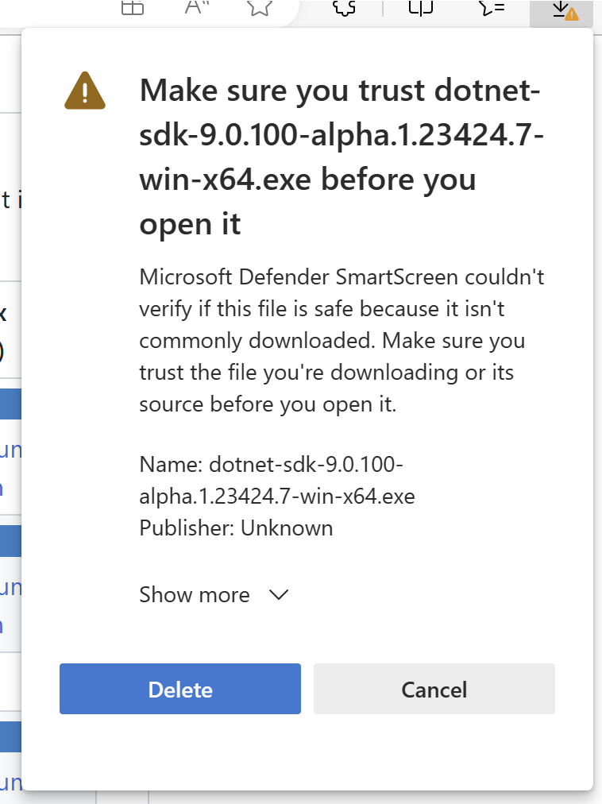

# Eighth Edition's support for .NET 9 and 10

Microsoft will release previews of .NET 9 regularly starting in February 2024 until the final version on Tuesday, November 12, 2024, one week after the US Presedentual Election on November 5.

- [Download .NET 9.0 SDK](https://dotnet.microsoft.com/download/dotnet/9.0)
- November 12, 2024: Announcing .NET 9.0 - The Bestest .NET Yet
- October, 2024: [Announcing .NET 9 Release Candidate 2](https://devblogs.microsoft.com/dotnet/announcing-dotnet-9-rc-2/)
- September, 2024: [Announcing .NET 9 Release Candidate 1](https://devblogs.microsoft.com/dotnet/announcing-dotnet-9-rc-1/)
- August, 2024: [Announcing .NET 9 Preview 7](https://devblogs.microsoft.com/dotnet/announcing-dotnet-9-preview-7/)
- July, 2024: [Announcing .NET 9 Preview 6](https://devblogs.microsoft.com/dotnet/announcing-dotnet-9-preview-6/)
- June, 2024: [Announcing .NET 9 Preview 5](https://devblogs.microsoft.com/dotnet/announcing-dotnet-9-preview-5/)
- May, 2024: [Announcing .NET 9 Preview 4](https://devblogs.microsoft.com/dotnet/announcing-dotnet-9-preview-4/)
- April, 2024: [Announcing .NET 9 Preview 3](https://devblogs.microsoft.com/dotnet/announcing-dotnet-9-preview-3/)
- March, 2024: [Announcing .NET 9 Preview 2](https://devblogs.microsoft.com/dotnet/announcing-dotnet-9-preview-2/)
- February, 2024: [Announcing .NET 9 Preview 1](https://devblogs.microsoft.com/dotnet/announcing-net-9-preview-1/)
- August 2023 to January 2024: [Download alpha versions of .NET 9](https://github.com/dotnet/installer#table)





## .NET 10

Microsoft will release previews of .NET 10 regularly starting in February 2025 until the final version on Tuesday, November 4, 2025 or Tuesday, November 11, 2025.

- [Download .NET 10.0 SDK](https://dotnet.microsoft.com/download/dotnet/10.0)
- November, 2025: Announcing .NET 10.0 - The Bestest .NET Yet
- October, 2025: [Announcing .NET 10 Release Candidate 2](https://devblogs.microsoft.com/dotnet/announcing-dotnet-10-rc-2/)
- September, 2025: [Announcing .NET 10 Release Candidate 1](https://devblogs.microsoft.com/dotnet/announcing-dotnet-10-rc-1/)
- August, 2025: [Announcing .NET 10 Preview 7](https://devblogs.microsoft.com/dotnet/announcing-dotnet-10-preview-7/)
- July, 2025: [Announcing .NET 10 Preview 6](https://devblogs.microsoft.com/dotnet/announcing-dotnet-10-preview-6/)
- June, 2025: [Announcing .NET 10 Preview 5](https://devblogs.microsoft.com/dotnet/announcing-dotnet-10-preview-5/)
- May, 2025: [Announcing .NET 10 Preview 4](https://devblogs.microsoft.com/dotnet/announcing-dotnet-10-preview-4/)
- April, 2025: [Announcing .NET 10 Preview 3](https://devblogs.microsoft.com/dotnet/announcing-dotnet-10-preview-3/)
- March, 2025: [Announcing .NET 10 Preview 2](https://devblogs.microsoft.com/dotnet/announcing-dotnet-10-preview-2/)
- February, 2025: [Announcing .NET 10 Preview 1](https://devblogs.microsoft.com/dotnet/announcing-net-10-preview-1/)

# All Chapters

After [downloading](https://dotnet.microsoft.com/download/dotnet/9.0) and installing .NET 9.0 SDK, follow the step-by-step instructions in the book and they should work as expected since the project file will automatically reference .NET 9.0 as the target framework. 

To upgrade a project in the GitHub repository from .NET 8.0 to .NET 9.0 just requires a target framework change in your project file.

Change this:

```xml
<TargetFramework>net8.0</TargetFramework>
```

To this:

```xml
<TargetFramework>net9.0</TargetFramework>
```

For projects that reference additional NuGet packages, use the latest NuGet package version, as shown in the rest of this page, instead of the version given in the book. You can search for the correct NuGet package version numbers yourself at the following link: https://www.nuget.org
